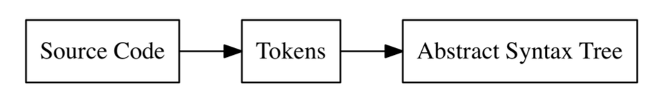

# Chap 1
## Interpreter
Interpreters take source code and evaluate it without producing some visible, intermediate result that can later be executed. That's in contrast to compilers, which take source code and produce output in another language that the underlying system can understand.

インタープリタとはおよそいずれかの動作をするプログラムである。

- ソースコードを直接解釈し実行する
- ソースコードを中間表現に、最初に全て変換して、あるいは逐次変換(JIT interpreters)しながら、解釈し、実行する
- コンパイラによって生成された中間表現を解釈、実行する

## Difference between interpreters and compilers
コンパイラは中間表現があって、システムによって実行可能な中間表現を生成する。また、コンパイラはインタープリタとは異なり、実行は伴わず、対象となる言語を他の言語(or 表現)に変換だけを行う。

## Assembler
Assemlyから機械語に変換するようなプログラム。

## Bytecode
Some interpreters compile input into an internal representation called bytecode.

## JIT interpreters
JIT interpreters compile the input just-in-time into native machine code that which gets then executed.

## Tree-walking interpreters
Tree-walking interpreters are interpreters that parse the source code, build an abstract syntax tree(AST) out of it and the evaluate this tree.

## First class functions
Functions are just values like integers or strings in the idea of first class functions.

## 1.1 Lexical analysis


Lexer: Does lexical analysis. It is also called tokernizer or scanner.

Lexical Analysis: The first transfomation, from source code to tokens. This process is also called "lexing".

Tokens: Small, easily categorized data structure that are then fed to parser. ソースコード上の文字列をそれ以上分けることのできない最小単位に分割したものを指す。

Parser: Does the second transfomation and turns the tokens in "Abstract Syntax Tree".

Example: Input into Lexer

```
"let x = 5 + 5"
```

Example: Output from Lexer

```
[
  LET,
  IDENTIFIER("x"),
  EQUAL_SIGN,
  INTEGER(5),
  PLUS_SIGN,
  INTEGER(5),
  SEMICOLON
]
```

What constitutes  a token varies between different lexer implementations. Some lexers, parse "5" to an integer in the parsing stage, while other lexers does not do that when constructing tokens. Tokenを生成するときに、lexerによっては、"5"をintegerとしてparseする。一方Tokenを生成するときに、"5"をintegerとしてparseしないものもある

## 1.2 Defining our tokens
Example input into Monkey language lexer

```
let five = 5;
let ten = 10;

let add = fn(x, y) {
  x + y;
};

let result = add(five, ten);
```

### Token data structure

```
// token/token.go
package token
type TokenType string
type Token struct {
  Type TokenType
  Literal string
}
```

### Token types

```
// token/token.go
const (
  ILLEGAL = "ILLEGAL"
  EOF = "EOF"

// identfier = 識別子, literal = 数字や文字列を記述した定数
// identifiers & literals
  IDENT = "IDENT" // add, foobar, x, y,...
  INT = "INT" //123456

// operators
  ASSIGN = "="
  PLUS = "+"

// delimiters
  COMMA = ","
  SEMICOLON = ";"

  LPAREN = "("
  RPAREN = ")"
  LBRACE = "{"
  RBRACE = "}"

// keywords
  FUNCTION = "FUNCTION"
  LET = "LET"
)
```

## 1.3 The lexer
Goal of this section is to wirite our own lexer.

- source code as input
- output the tokens that represent the source code

- NextToken() will output the next token
- initialize the lexer with source code and then repeatedly call NextToken()

In production, it is better to attach filenames and line numbers to tokens to track down lexing and parsing errors. However, in this book, there will not be any code to do that. Beacuase it is really complicated.

### `position` and `readPosition`
- Both will be used to access characters in input by using them as an index
- The reason for these two "poiters" pointing into input string is that it will be necessary to be able to "peek" further into the input to look after the current character to see what comes up next
- `readPosition` always points to the "next" character in the input
- `position` points to the character in the input that coresspond to the ch byte

## 1.4 Extending our token set and lexer
In this section support for `==`, `!`, `!=`, `-`, `/`, `*`, `<`, `>`, `true`, `false`, `if`, `else`, `return` will be added

## 1.5 Start of a repl
REPL stands for "Read Eval Print Loop". Sometimes the REPL is called "console", sometimes "interactive mode". REPL reads input, sends it to the interpreter for evaluation, prints the result(output) of the interpreter and starts again. Read, Eval, Print, Loop
