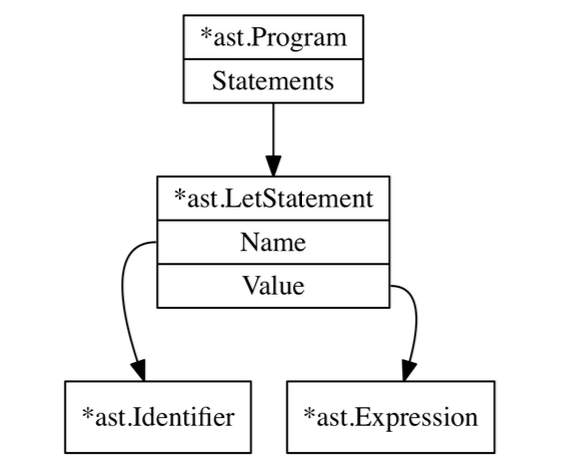

# Chap 2
## 2.1 Parsers
Parsers take source code as input and produce a data structure which represents the source code. Inputs to parser are the tokens.

### memo
Although each implementations of AST are all pretty similar, there is not one true, universal AST format that's used by every parser

## 2.2 Why not a parser generator?
### Parser generator
Parser genrerators are tools that, when fed with a formal description of a language, produce parser as their output. The output is code that can then be compiled/interpreted and itself fed with source code as input to produce a syntax tree. The majority of them use a context-free grammar as their input.

Parsers are exceptionally well suited to being automatically generated. So, it is recommended to use parser generator for production-environment, where correctness and robustness are priorities.

### Context-Free Grammar
A CFG is a set of rules that describes how to form correct sentences in a language. Common notational formats of CFGs are the BNF or the EBNF. EBNF stands for(Extended BNF).

## 2.3 Writing a parser for the Monkey programming language
There are two main strategies to parse a programming language:

- top-down parsing
- bottom-up parsing

In this section, we will write a recursive descent parser. It's a "top-down operator precedence" parser

The difference between top-down and bottom-up parsers is that the former starts with constructing root node of the AST and then descends while the latter does it the other way around.

## 2.4 Parser's first steps: parsing let statement
"Parse let statements correctly" means that the parser produces an AST that accurately represents the information contained in the original let statement.

example code

```
let x = 10;
lex y = 15;

let add = fn(a, b) {
  return a + b;
};
```

In the example above, there are three statements, three variable bindings - let statements - of the following form:

```
let <identifier> = <expression>;
```

identfiers are:
- `x`
- `y`
- `add`

expressions are:
- `10`
- `15`
- `function`

### peekToken and curToken
They act like the two "pointers" that the lexer we've made has: `position` and `readPosition`. `readPosition`はもうちょっと分かりやすい名前にしたい。`peekToken`と合わせて、`peekPosition`みたいな名前にしたい。また、`position`も`curPosition`の方が分かりやすい気がする

### ParseProgram
Constructs the root node of the AST, an `*ast.Program`. It then iterates over every token in the input until it encounters an `token.EOF` token. It does this by repeatedly calling `nextToken`, which advances both `p.curToken` and `p.peekToken`

### The difference between statements and expressions
Expressions produce values, statements don't.

- `let x = 5;` doesn't produce a value, whereas `5` does(the value it produces is 5)
- `return 5;` statements doesn'produce a value, but `add(5, 5)` does
- A lot of things in Monkey are expressions including function literals
<!--
TODO unclear points
-->
- identifiers in other parts of a Monkey program do produce value, for example, `let x = valueProducingIdentifer;`

```
let x = 5;
```

The code above could be represented by an AST just like this



式は値を生成し、変数に代入可能なものを指す. 例として以下のようなものがあげられる
- `42`のようなリテラル(ソースコード内に直接値を表記したものを指す)
- `foo`といった変数
- `hoge()`といった関数呼び出し

文は処理する1ステップを指す. 例としてはif文やfor文. 文の処理の一部として式を含むことがある. 以下の例では、isTrueという式が文の中に出てきている

```
const isTrue = true;
if (isTrue) {
}
```

if文は式ではなく、文であるため代入ができない

```
const ff = if (true) {...}
```

jsにはfunction式とfunction文がある

```
function learn() {
  ...
}

const a = function() {
  ...
};


```
## 2.6 Parsing expressions
Everything besides `let` and `return` statements is an expression

## 参考・引用
- [JavaScript Primer 文と式](https://jsprimer.net/basic/statement-expression/)
