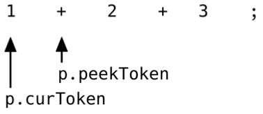
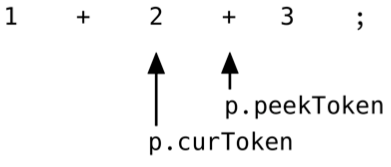

# Chap 2
## 2.1 Parsers
Parsers take source code as input and produce a data structure which represents the source code. Inputs to parser are the tokens.

### memo
Although each implementations of AST are all pretty similar, there is not one true, universal AST format that's used by every parser.

## 2.2 Why not a parser generator?
### Parser generator
Parser genrerators are tools that, when fed with a formal description of a language, produce parser as their output. The output is code that can then be compiled/interpreted and itself fed with source code as input to produce a syntax tree. The majority of them use a context-free grammar as their input.

Parsers are exceptionally well suited to being automatically generated. So, it is recommended to use parser generator for production-environment, where correctness and robustness are priorities.

### Context-Free Grammar
A CFG is a set of rules that describes how to form correct sentences in a language. Common notational formats of CFGs are the BNF or the EBNF. EBNF stands for(Extended BNF).

## 2.3 Writing a parser for the Monkey programming language
There are two main strategies to parse a programming language:

- top-down parsing
- bottom-up parsing

In this section, we will write a recursive descent parser. It's a "top-down operator precedence" parser.

The difference between top-down and bottom-up parsers is that the former starts with constructing root node of the AST and then descends while the latter does it the other way around.

## 2.4 Parser's first steps: parsing let statement
"Parse let statements correctly" means that the parser produces an AST that accurately represents the information contained in the original let statement.

example code

```
let x = 10;
lex y = 15;

let add = fn(a, b) {
  return a + b;
};
```

In the example above, there are three statements, three variable bindings - let statements - of the following form:

```
let <identifier> = <expression>;
```

identfiers are:
- `x`
- `y`
- `add`

expressions are:
- `10`
- `15`
- `function`

### peekToken and curToken
They act like the two "pointers" that the lexer we've made has: `position` and `readPosition`. `readPosition`はもうちょっと分かりやすい名前にしたい。`peekToken`と合わせて、`peekPosition`みたいな名前にしたい。また、`position`も`curPosition`の方が分かりやすい気がする。

### ParseProgram
Constructs the root node of the AST, an `*ast.Program`. It then iterates over every token in the input until it encounters an `token.EOF` token. It does this by repeatedly calling `nextToken`, which advances both `p.curToken` and `p.peekToken`.

### The difference between statements and expressions
Expressions produce values, statements don't.

- `let x = 5;` doesn't produce a value, whereas `5` does(the value it produces is 5)
- `return 5;` statements doesn'produce a value, but `add(5, 5)` does
- A lot of things in Monkey are expressions including function literals
- identifiers in other parts of a Monkey program do produce value, for example, `let x = valueProducingIdentifer;`

```
let x = 5;
```

The code above could be represented by an AST just like this


式は値を生成し、変数に代入可能なものを指す. 例として以下のようなものがあげられる。
- `42`のようなリテラル(ソースコード内に直接値を表記したものを指す)
- `foo`といった変数
- `hoge()`といった関数呼び出し

文は処理する1ステップを指す. 例としてはif文やfor文. 文の処理の一部として式を含むことがある. 以下の例では、isTrueという式が文の中に出てきている。

```
const isTrue = true;
if (isTrue) {
}
```

if文は式ではなく、文であるため代入ができない

```
const ff = if (true) {...}
```

jsにはfunction式とfunction文がある

```
function learn() {
  ...
}

const a = function() {
  ...
};
```

## Tokens & AST
Original Code

```
let x = 5;
let y = 10;
```

Tokens generated by lexer(input original code)

```
{
  {token.LET, "let"},
  {token.IDENT, "x"},
  {token.ASSIGN, "="},
  {token.INT, "5"},
  {token.SEMICOLON, ";"},
  {token.LET, "let"},
  {token.IDENT, "y"},
  {token.ASSIGN, "="},
  {token.INT, "10"},
  {token.SEMICOLON, ";"},
  {token.EOF, ""},

}
```

AST generated by parser(input tokens)

```
program := &Program{
  Statements: []Statement{
    &LetStatement{
      Token: token.Token{Type: token.LET, Literal: "let"},
      // 変数名(左辺)
      Name: &Identifier{
        Token: token.Token{Type: token.IDENT, Literal: "x"},
        Value: "x",
      },
      // 変数の値(右辺)
      Value: &Identifier{
        // 今回の場合はこれIDENTにするのかINTにするのかよくわからない
        Token: token.Token{Type: token.INT, Literal: "5"},
        Value: "5",
      },
    },
    &LetStatement{
      Token: token.Token{Type: token.LET, Literal: "let"},
      Name: &Identifier{
        Token: token.Token{Type: token.IDENT, Literal: "y"},
        Value: "x",
      },
      Value: &Identifier{
        Token: token.Token{Type: token.INT, Literal: "10"},
        Value: "10",
      },
    },
  },
}
```

## 2.6 Parsing expressions
Everything besides `let` and `return` statements is an expression.

### Terminology
A prefix operator is an operator "in front of" its operand.

example

```
--5;
```

A postfix operator is an operator "after" its operand. There won't be 'postfix operators implementation in Monkey to make things simple.

example

```
count++;
```

An infix operator sits between its operands.

example

```
5 * 8;
```

The order of operations(operator precedence) is operator precedence description.

example

```
5 + 5 * 10
```

In the above example, `*` operator has a higher precedence than `*` operator. So the calculation must start from `5 * 10`.

### Adding expressions statement to AST
It is totally legal to write the following code in Monkey. The first line is a let statment and the second line is an expression statment. To enable following code to be parsed correctly, we need to add expression statement our AST.

```
let x = 5;
x + 10;
```

`ast.ExpressionStatement` fulfils the `ast.Statement` interface, which means that we can add it to the `Statements ` slice of `ast.Program`

### Expression statement(式文)
- 基本的には文が書けるところには式を書くことができる。文となった式のことを式文と呼ぶ
- Most scripting language have expression statement.

```
let x = 5;
x + 10;
```

The first line is a let statement, the second line is an expression statement.

### Implementing the Pratt parser
- main idea of Pratt parser is the association of parsing functions with token types
- whenever a token type is encountered, the parsing functions are called to parse the appropriate expression and return an AST node that represents it

To setup the associations, we define two types of functions, prefix parsing functions and an infix parsing functions

### Prefix operators
There are two prefix operators in Monkey:
- `-`
- `!`

code example

```
-5;
!foobar;
5 + -10;
```

the structure of the above code's usage is the following:

```
<prefix operator> <expression>;
```

Any expression can follow a prefix operator as operand and the following code is valid

```
!isGreaterThanZero(2);
5 + -add(5, 5)
```

### Infix operators

```
5 + 5;
5 - 5;
5 * 5;
5 / 5;
5 > 5;
5 < 5;
5 == 5;
5 != 5;
```

```
<expression> <infix operator> <expression>
```

## 2.7 How Pratt parsing works

```
1 + 2 + 3;
```

上のコードをパースして、以下のコードを生成することを期待して、考える。

```
((1 + 2) + 3);
```

まず、パースして上のようなコードを生成するには、ASTは2つの`*ast.InfixExpression` nodesを含む必要がある。
以下の図のようなASTを生成することをゴールとする。


どのように、このようなASTを生成するかこれから考えていく。

まず始めに、`parseExpressionStatement`が呼ばれて、その中から、`parseExpression(LOWEST)`を呼ぶ。この時点で`p.curToken`と`p.peekToken`はそれぞれ`1`と`+`を指している。parseExpressionで最初に行われるのは、`p.curToken.Type`に関連した`prefixParseFn`が存在するかどうかを確認することである。この時点で`p.curToken.Type`は`token.INT`で、`prefixParseFn`である`parseIntegerLiteral`が存在する事がわかる。次に`parseIntegerLiteral`を呼び出し、そこから戻ってきた`*ast.IntegerLiteral.parseExpression`が戻り値として返され、それが`leftExp`に代入される。



その後のコードで、それぞれのcursorが1ずつ右にずらされ、今度は、`p.peekToken.Type`に対しての、`infixParseFn`が存在するかどうかを確認する。


説明略(codeを見ること)



1と2を子nodeとして持つ、`*ast.InfixExpression`nodeが上記のステップによって生成される。


最終的には以下のような`*ast.InfixExpression`nodeが生成される。


`;`にぶち当たるので、ここでnodeの生成の処理が終わる。


### Precedenceについて
The goal is to have expressions involving operators with a higher precedence to be deeper in the tree than expressions with lower precedence operators.

### Right-binding power
The higher it is, the more tokens/operators/operands to the right of the current expression(the future peek tokens) can we "bind" to it, or to think "suck in".

- 絶対にprecedenceが高いものは右の方にある
- 右に留まる力ってイメージ

### Left-binding power
Left-binding power of the next operator come from call to `peekPrecedence`. The value this call returns stadns for the left-binding power of the next operator, of `p.peekToken`

左に留まる力ってイメージ

## 参考・引用
- [JavaScript Primer 文と式](https://jsprimer.net/basic/statement-expression/)
